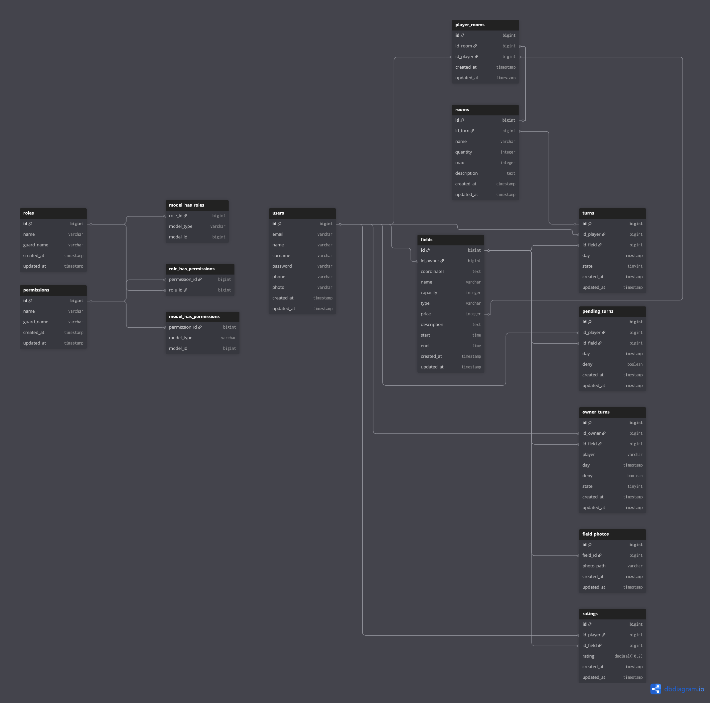
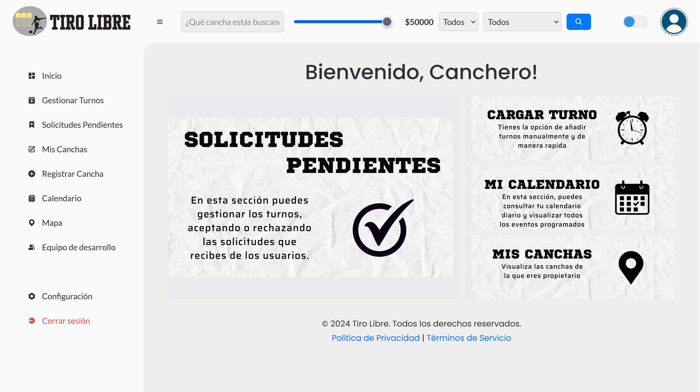
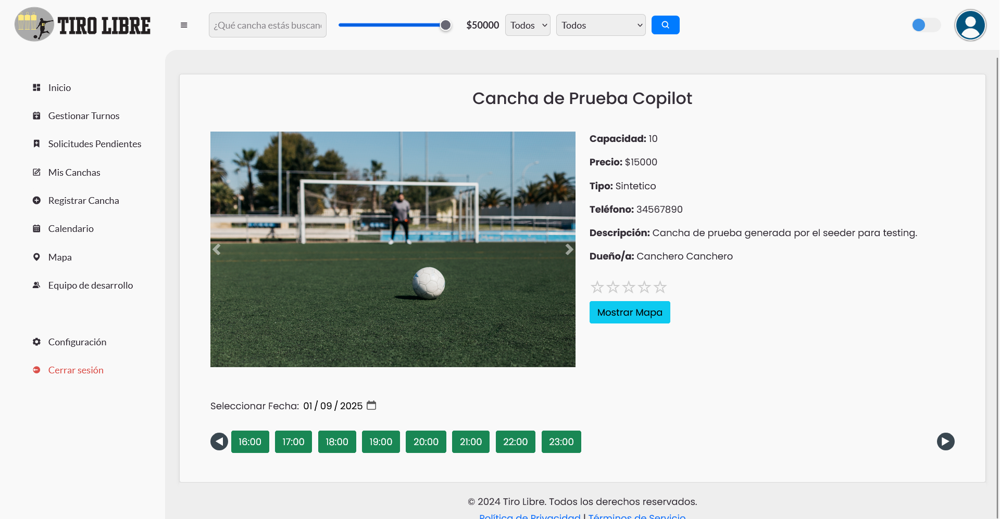
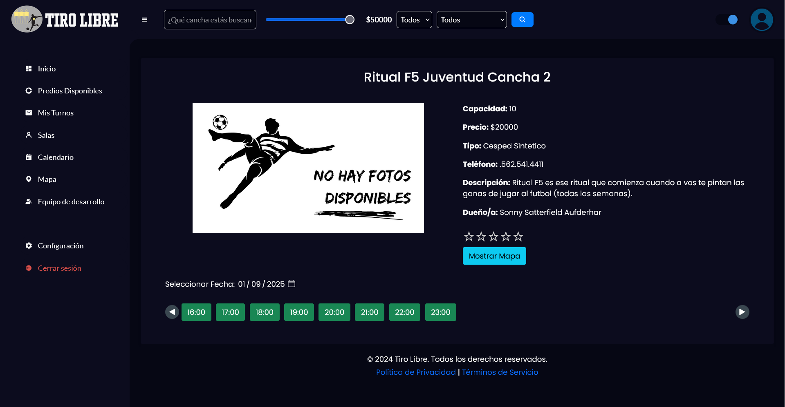
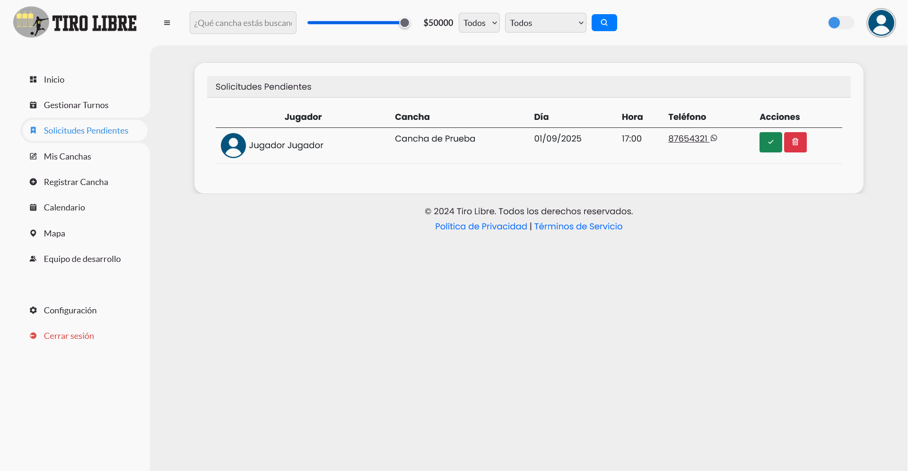
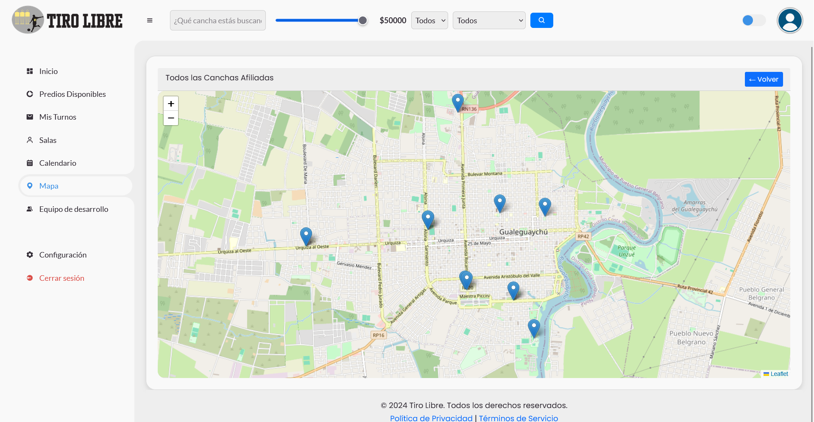

# ⚽ Tiro Libre: Plataforma Integral para Alquiler de Canchas

Tiro Libre es una solución digital moderna que conecta a jugadores y propietarios de canchas, facilitando la reserva, gestión y promoción de espacios deportivos. Nuestra misión es digitalizar la experiencia de alquilar canchas, optimizando la organización de partidos y la búsqueda de compañeros de juego.

---

## 🚀 Descripción

Tiro Libre permite a los usuarios buscar, reservar y administrar canchas deportivas de manera sencilla y eficiente. Los propietarios pueden publicar y promocionar sus canchas, mientras que los jugadores encuentran las mejores opciones según ubicación, precio y disponibilidad. Además, la plataforma fomenta la creación de comunidades deportivas mediante la formación de equipos y salas de juego.

---

## ✨ Características Principales

- Gestión de usuarios con roles diferenciados (Jugador, Canchero, Administrador, Super Administrador)
- Autenticación y autorización segura
- Publicación y promoción de canchas
- Búsqueda avanzada de canchas por ubicación, precio y disponibilidad
- Creación de salas para encontrar y sumar jugadores
- Notificaciones automáticas (incluyendo integración con WhatsApp)
- Panel de administración para gestión de datos críticos
- Sistema de reservas y pagos
- Soporte para múltiples dispositivos

---

## 🛠️ Tecnologías Utilizadas

- **Backend:** [Laravel 10](https://laravel.com/) 
- **Frontend:** Blade (Laravel), HTML5, CSS3, JavaScript ES6
- **Lenguajes:** PHP 8.1 , JavaScript 
- **Base de datos:** MySQL 8 
- **Herramientas:** Composer, Node.js, NPM, SweetAlert2, FullCalendar, Axios
- **Integraciones:** WhatsApp Web JS (para notificaciones automáticas)
- **Servidor recomendado:** Laragon 6.0, Apache 2.4
---

## 🏗️ Arquitectura

A continuación se muestra un diagrama simple de la arquitectura de Tiro Libre:

```
┌──────────────────────────────┐
│        Usuario Final         │
│ (Navegador Web/Dispositivo)  │
└─────────────┬────────────────┘
              │
              ▼
┌──────────────────────────────┐
│         Frontend             │
│  Blade (Laravel), JS, CSS    │
└─────────────┬────────────────┘
              │
              ▼
┌──────────────────────────────┐
│          Backend             │
│        Laravel 10            │
│  (PHP, Controladores, Rutas, │
│   Autenticación, Lógica)     │
└─────────────┬────────────────┘
              │
              ▼
┌──────────────────────────────┐
│        Base de Datos         │
│           MySQL              │
└──────────────────────────────┘
```

**Descripción:**
- El usuario interactúa con la aplicación web a través del navegador.
- El frontend está construido con Blade (Laravel), HTML, CSS y JavaScript.
- El backend utiliza Laravel 10 (PHP) para gestionar la lógica de negocio, autenticación, rutas y controladores.
- Toda la información se almacena y consulta desde una base de datos MySQL.

---

## 🗃️ Estructura de la Base de Datos



*Diagrama interactivo disponible en: [dbdiagram.io](https://dbdiagram.io/d/tiro-libre-68b5a733777b52b76c80ca67)*

---

## ⚙️ Instalación y Ejecución

### Requisitos Previos

- PHP >= 8.1
- Composer
- Node.js >= 16.x y NPM
- MySQL >= 8.0
- Laragon 6.0 (recomendado para entorno local)
- Git

### Pasos de Instalación

1. **Clona el repositorio:**
   ```bash
   git clone https://github.com/Felipe-258/tiro-libre.git
   cd tiro-libre
   ```

2. **Instala dependencias de backend:**
   ```bash
   composer install
   ```

3. **Instala dependencias de frontend:**
   ```bash
   npm install
   ```

4. **Configura el entorno:**
   - Copia `.env.example` a `.env`
   - Modifica las variables según tu entorno (DB, correo, etc.)
   - Asegúrate de tener `QUEUE_CONNECTION=database` en la línea correspondiente

5. **Genera la clave de la aplicación:**
   ```bash
   php artisan key:generate --ansi
   ```

6. **Ejecuta migraciones y seeders (opcional):**
   ```bash
   php artisan migrate
   # Para datos de prueba (Recomendado):
   php artisan migrate:refresh --seed
   ```

7. **Crea el enlace de almacenamiento:**
   ```bash
   php artisan storage:link
   ```

8. **Levanta el frontend en modo desarrollo:**
   ```bash
   npm run dev
   ```

9. **Inicia el backend:**
   - Con Laragon: desde el menú WWW selecciona el proyecto
   - O manualmente:
     ```bash
     php artisan serve
     ```

10. **(Opcional) Notificaciones por WhatsApp:**
    - Ejecuta:
      ```bash
      node resources/js/whatsapp/whatsapp.js
      php artisan queue:work
      ```

---

## 🧪 Credenciales de Prueba

> _Credenciales de prueba:_
- **Administrador:** admin@example.com / 12345678
- **Canchero:** canchero@example.com / 12345678
- **Jugador:** jugador@example.com / 12345678

---

## 📸 Capturas de Pantalla

> _Ejemplo:_
> 
> 
> 
> 
> 
> 


---

## 👥 Créditos al Equipo

- [Felipe Franco](https://github.com/Felipe-258)
- [Federico Martinolich](https://github.com/FedericoMartinolich)
- [Facundo Jara](https://github.com/P2jaraFacundo)

---

## 📄 Licencia

Este proyecto está bajo una Licencia de Uso Educativo. Consulta el archivo [LICENSE](./LICENSE) para más detalles.

**Permisos:**
- ✅ Uso educativo y académico
- ✅ Investigación y estudio
- ✅ Modificación y distribución para fines educativos

**Restricciones:**
- ❌ Uso comercial o profesional
- ❌ Implementación en producción sin autorización
- ❌ Distribución con fines de lucro

Para uso comercial o profesional, por favor contacta al equipo de desarrollo para obtener una licencia apropiada.

¡Gracias por tu interés en Tiro Libre! Si tienes preguntas o sugerencias, no dudes en contactarnos.